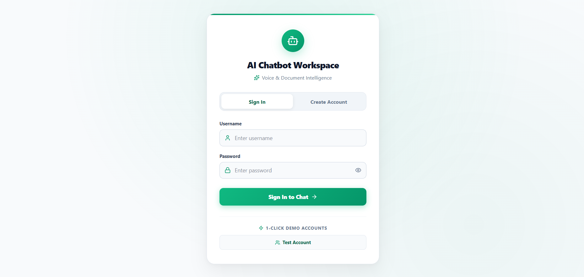
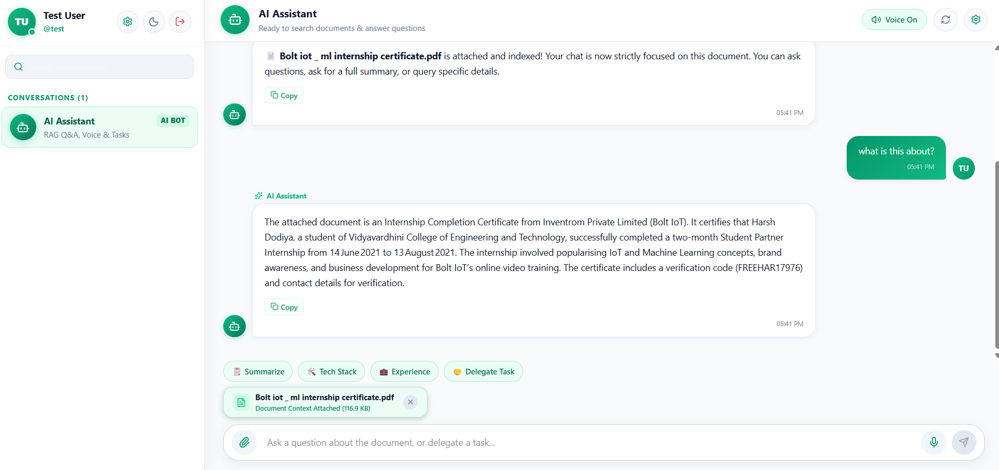

# Real-Time Multimodal Voice & RAG Assistant

A full-duplex, low-latency AI assistant and collaborative chat platform featuring document-grounded **Retrieval-Augmented Generation (RAG)**, conversational **Speech-to-Speech** streaming, and **Autonomous Task Delegation**.

---

## 📸 Screenshots

| Login & Demo Access | AI Assistant & Document Chat |
| :---: | :---: |
|  |  |

---

## 🚀 What Is It?

This project is a real-time conversational workspace that blends **Generative AI** with team collaboration. Users can chat with colleagues, talk to an AI assistant via streaming voice or text, upload and question complex documents (`.pdf`, `.docx`, `.pptx`, `.txt`), and have the AI autonomously detect, formulate, and delegate actionable tasks to teammates in real time.

---

## 🛠️ Tech Stack

| Layer | Technologies |
| :--- | :--- |
| **Frontend** | React 18, Vite, Tailwind CSS, Lucide Icons, Socket.IO Client, Web Audio / MediaRecorder API |
| **Backend** | Node.js, Express, TypeScript, Socket.IO, Multer |
| **Database** | MongoDB & Mongoose (conversations and message persistence) |
| **Vector DB & RAG** | Pinecone (`llama-text-embed-v2`, 1024-dim inference embeddings) |
| **LLM & Inference** | Groq / OpenAI (`gpt-4o`, `compound-mini`) with JSON schema enforcement & token streaming |
| **Speech Processing** | **Deepgram** (`nova-2` ASR for speech-to-text) & **Cartesia** (`sonic-3.6` ultra-low-latency streaming TTS) |
| **Document Parsers** | `pdf-parse`, `mammoth` (Word), `officeparser` (PowerPoint/Office) |

---

## ✨ Key Features

* **🎙️ Full-Duplex Voice Assistant**: Talk naturally to the AI. Incoming speech is transcribed via **Deepgram**, processed through RAG/LLM, and spoken back in real time through **Cartesia streaming PCM audio** over WebSockets.
* **📄 Multi-Format Document RAG**: Upload `.pdf`, `.docx`, `.pptx`, `.txt`, and `.md` files. Documents are extracted, cleaned of binary stream artifacts, chunked into ~500-character passages, and indexed into Pinecone.
* **🔍 Contextual Query Reformulation**: Multi-turn questions (e.g., *"What were his main responsibilities there?"*) are automatically rewritten using chat history into standalone semantic queries before vector search.
* **⚡ Autonomous Task Delegation**: Using structured JSON contracts, the AI identifies assignees, actions, and deadlines from conversation, creates task entries, and routes live alerts to the designated teammate's screen.
* **💬 Peer-to-Peer Realtime Messaging**: Direct 1-on-1 team messaging over isolated Socket.IO rooms with message history stored in MongoDB.
* **🌓 Modern UI**: Responsive layout with dark/light themes, markdown rendering, copy-to-clipboard actions, live chunk streaming, and interactive task cards.

---

## 🔄 How It Works

```
1. INGESTION PIPELINE:
   Document Upload ──> Format Extraction ──> Text Sanitization ──> Chunking (~500 chars)
   ──> Pinecone Embedding (1024-dim) ──> Upsert to Vector DB

2. RETRIEVAL & GENERATION PIPELINE:
   User Query (Text / Audio via Deepgram)
   ──> Conversational Query Reformulation (LLM)
   ──> Cosine Similarity Search in Pinecone (top-K chunks, document filter)
   ──> Context Injection into System Prompt
   ──> Streaming LLM Response (JSON delta parser ──> Socket.IO chunks)
   ──> Text-to-Speech Streaming (Cartesia WebSocket ──> Browser Audio)

3. TASK DELEGATION PIPELINE:
   User Prompt ("Assign bug fix to Test User by tomorrow")
   ──> LLM outputs { "type": "assign_task", "assignee": "...", "task": "...", "deadline": "..." }
   ──> Backend resolves assignee & saves task to recipient's conversation
   ──> Real-time alert dispatched to assignee via Socket room
```

---

## 🏁 Getting Started

### 1. Prerequisites
* **Node.js** (v18 or higher)
* **MongoDB** instance (local or MongoDB Atlas)
* API Keys:
  * **OpenAI** or **Groq**
  * **Pinecone** (Index name: `ai-chatbot`, dimension: 1024, metric: cosine)
  * **Deepgram**
  * **Cartesia**

---

### 2. Backend Setup

```bash
cd back-end
npm install
```

Create a `.env` file in `back-end/`:

```env
PORT=3001
FRONTEND_URL=http://localhost:5173
MONGO_URI=your_mongodb_connection_string

# LLM Configuration
GROQ_API_KEY=your_groq_api_key_here
# or OPENAI_API_KEY=your_openai_api_key_here
MODEL_NAME=gpt-4o

# Vector DB & Embeddings
PINECONE_API_KEY=your_pinecone_api_key_here
PINECONE_INDEX_NAME=ai-chatbot
PINECONE_EMBEDDING_MODEL=llama-text-embed-v2

# Voice Processing
DEEPGRAM_API_KEY=your_deepgram_api_key_here
CARTESIA_API_KEY=your_cartesia_api_key_here
CARTESIA_MODEL_ID=sonic-3.6
```

Start the backend:

```bash
# Development mode
npm run dev

# Production build & run
npm run build
npm start
```

---

### 3. Frontend Setup

```bash
cd front-end
npm install
```

Create a `.env` file in `front-end/`:

```env
VITE_API_URL=http://localhost:3001
```

Start the frontend:

```bash
npm run dev
```

Open [http://localhost:5173](http://localhost:5173) in your browser.

---

## 🔑 Quick Demo Login

The application comes preconfigured with a 1-click test account:
* **Username**: `test`
* **Password**: `1`
*(You can also register new user accounts directly through the UI)*
